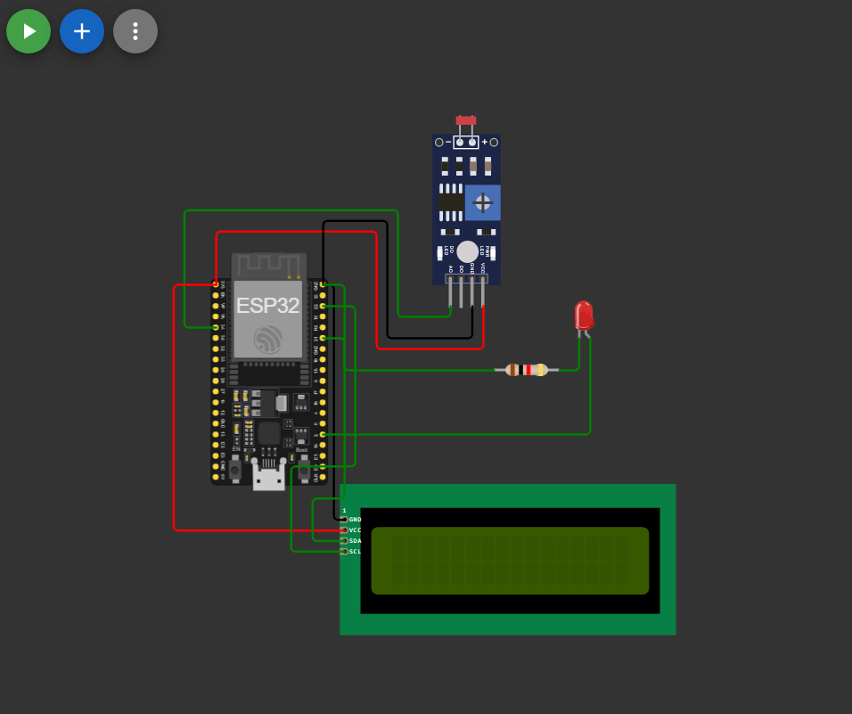

# Automatic Night Lamp Using ESP32, LDR Module, LED, and I2C LCD

## Overview

This project demonstrates an Automatic Night Lamp using an ESP32, an LDR module, an LED, and a 16x2 I2C LCD. The system automatically turns the LED ON when the surrounding environment becomes dark and turns it OFF when sufficient light is available.

The LCD displays the current LDR reading and lamp status in real time using flicker-free updates.

## Components Used

- ESP32
- LDR Sensor Module
- LED
- 16x2 I2C LCD Display
- Jumper Wires


## 🔗 Simulation Link

👉 [Open Simulation](https://wokwi.com/projects/465603412317272065)

---

## 🔌 Circuit Diagram

👉 

---


### LDR Module

| LDR Module Pin | ESP32 Pin |
|---------------|-----------|
| VCC | 3.3V |
| GND | GND |
| AO | GPIO 34 |

### LED

| LED Pin | ESP32 Pin |
|---------|-----------|
| Anode (+) | GPIO 2 |
| Cathode (-) | GND |

### I2C LCD

| LCD Pin | ESP32 Pin |
|---------|-----------|
| VCC | 5V |
| GND | GND |
| SDA | GPIO 21 |
| SCL | GPIO 22 |

## Working Principle

1. The ESP32 continuously reads the analog value from the LDR module.
2. The current LDR reading is displayed on the LCD.
3. When the ambient light level falls below the predefined threshold:
   - The LED turns ON.
   - The LCD displays `Lamp: ON`.
4. When sufficient light is available:
   - The LED turns OFF.
   - The LCD displays `Lamp: OFF`.
5. The process repeats continuously, creating an automatic night lamp system.

## Features

- Automatic light detection
- Real-time LCD monitoring
- Flicker-free LCD updates
- Uses an LDR module directly
- No external resistor or voltage divider required
- Beginner-friendly ESP32 project
- Suitable for Wokwi simulation and real hardware implementation

## Sample Output

### Bright Environment

```text
LDR: 3800
Lamp: OFF
```

### Dark Environment

```text
LDR: 450
Lamp: ON
```

## LCD Optimization

To prevent LCD flickering, the display is updated without repeatedly calling `lcd.clear()` inside the main loop. Instead, only the changing values are refreshed, resulting in smoother and more efficient display updates.

## Applications

- Automatic room lighting
- Smart home automation
- Street light prototypes
- Energy-saving systems
- IoT learning projects
- Embedded systems practice

## Notes

- This project uses an LDR module with built-in circuitry.
- No external resistor or voltage divider is required for the LDR sensor.
- The threshold value can be adjusted according to the sensor readings observed in the Serial Monitor.
- The project can be simulated easily in Wokwi before hardware implementation.


## Future Improvements

- Add buzzer alerts for darkness detection.
- Display light intensity percentage on the LCD.
- Add Wi-Fi monitoring using ESP32.
- Upload sensor data to an IoT dashboard.
- Implement adjustable threshold control using a potentiometer.


## 👨‍💻 Author


**Kritish**

