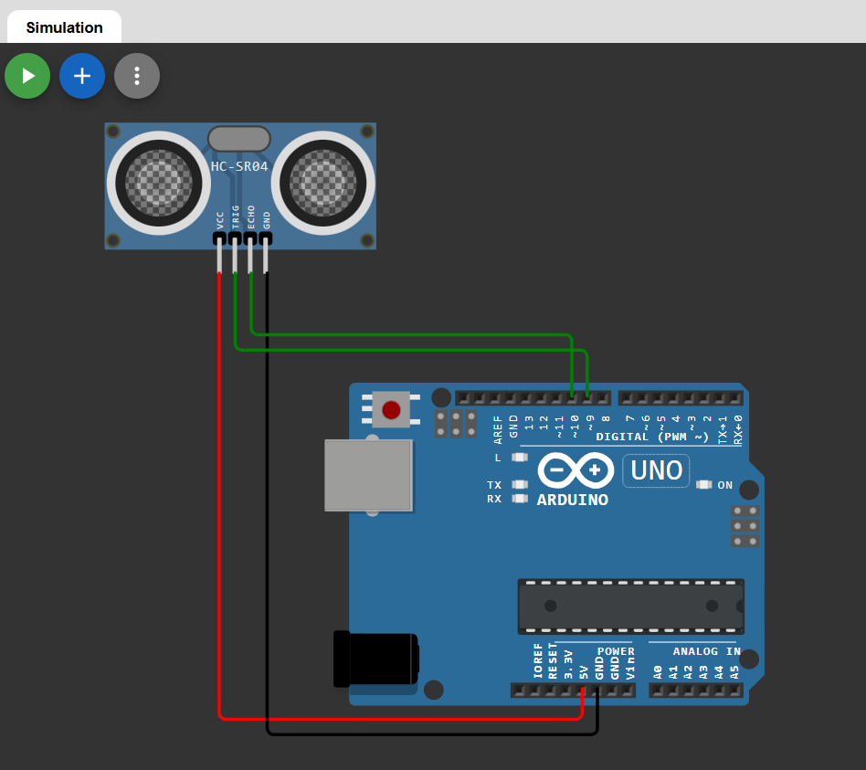

# 📏 Distance Measurement using Ultrasonic Sensor (HC-SR04)

This project demonstrates a **distance measurement system** using an ultrasonic sensor and Arduino.  
The sensor measures the distance of an object and displays the value on the Serial Monitor.

The project is simulated using Wokwi.

---

## 🔗 Simulation Link

👉 [Open Simulation](https://wokwi.com/projects/457309669174649857)

---

## 🔌 Circuit Diagram

👉 

---

## 🔧 Components Required

- Arduino Uno  
- Ultrasonic Sensor
- Breadboard  
- Jumper Wires  

---

## 🔌 Pin Connections

| Ultrasonic Pin | Arduino Pin |
|----------------|------------|
| VCC            | 5V         |
| GND            | GND        |
| TRIG           | D9         |
| ECHO           | D10        |

---

## 🧠 Working Principle

- The TRIG pin sends an ultrasonic pulse.
- The sound wave travels through air and reflects back from an object.
- The ECHO pin receives the reflected signal.
- Arduino measures the time taken for the echo to return.
- Distance is calculated using the formula:

Distance (cm) = (Time × Speed of Sound) / 2  

Speed of sound ≈ 0.034 cm/µs

The division by 2 is done because the sound travels to the object and back.

---

## 💻 Arduino Code

```cpp
#define trigPin 9
#define echoPin 10

long duration;
float distance;

void setup() {
  pinMode(trigPin, OUTPUT);
  pinMode(echoPin, INPUT);
  Serial.begin(9600);
}

void loop() {
  // Clear TRIG
  digitalWrite(trigPin, LOW);
  delayMicroseconds(2);

  // Send 10µs pulse
  digitalWrite(trigPin, HIGH);
  delayMicroseconds(10);
  digitalWrite(trigPin, LOW);

  // Read ECHO
  duration = pulseIn(echoPin, HIGH);

  // Calculate distance
  distance = duration * 0.034 / 2;

  Serial.print("Distance: ");
  Serial.print(distance);
  Serial.println(" cm");

  delay(500);
}
```
---
## 📌 Applications

- Obstacle detection

- Parking assist systems

- Robotics projects

- Distance-based automation

- Smart dustbin systems

## 🚀 Future Improvements

- Display distance on LCD/OLED

- Add buzzer for close object alert

- Servo motor radar system

- IoT distance monitoring

- Automatic water level indicator
## 👨‍💻 Author


**Kritish**

