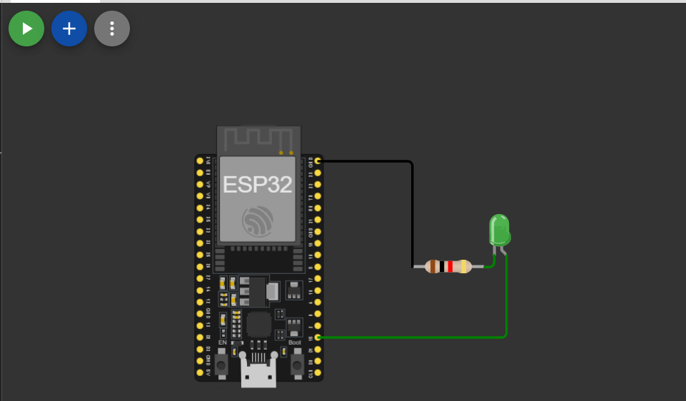

# LED Blink with ESP32

A simple ESP32 project to blink an LED connected to a digital GPIO pin using basic `digitalWrite()` control.

## Overview

This project turns an LED ON for 1 second and OFF for 1 second continuously using an ESP32 board.

The LED is connected to GPIO pin `15`.

##  Simulation Link
 [Open Simulation](https://wokwi.com/projects/464426748324791297)
##  Circuit Diagram

 
##  Circuit Connection


## Components Required

- ESP32 board
- LED
- 220Ω resistor
- Breadboard
- Jumper wires

## Circuit Connection

| Component | Connection |
|---|---|
| LED Anode (+) | GPIO 15 |
| LED Cathode (-) | GND through 220Ω resistor |

## Code

```cpp
#define LED 15

void setup() {
  pinMode(LED, OUTPUT);
}

void loop() {
  digitalWrite(LED, HIGH); // LED ON
  delay(1000);

  digitalWrite(LED, LOW);  // LED OFF
  delay(1000);
}
```

## How It Works

- `pinMode(LED, OUTPUT)` configures GPIO 15 as an output pin.
- `digitalWrite(LED, HIGH)` turns the LED ON.
- `delay(1000)` waits for 1000 milliseconds (1 second).
- `digitalWrite(LED, LOW)` turns the LED OFF.
- The loop repeats continuously.

## Upload Instructions

1. Connect your ESP32 board to your computer.
2. Open the ARDUINO IDE.
3. Select the correct board and COM port.
4. Paste the code into a new sketch.
5. Click Upload.
6. The LED should start blinking after upload.

## Learning Concepts

- GPIO output control
- Using `pinMode()`
- Using `digitalWrite()`
- Timing with `delay()`
- Basic embedded programming with ESP32

## License

This project is open-source and free to use for learning purposes.


