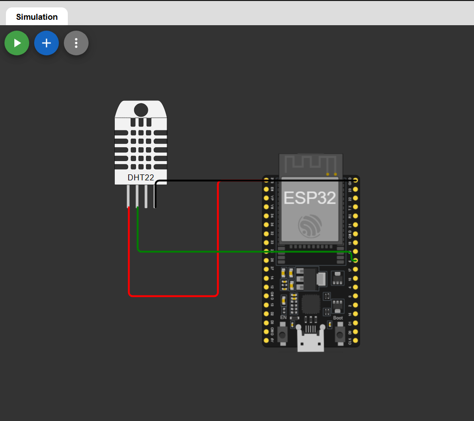

# ESP32 Temperature and Humidity Monitor using DHT22

## Overview

This project demonstrates how to interface a DHT22 temperature and humidity sensor with an ESP32 using wowki. The ESP32 reads temperature and humidity values from the sensor and displays them on the Serial Monitor.

## Components Required

* ESP32 Development Board
* DHT22 Sensor
* Jumper Wires
* Breadboard


## 🔗 Simulation Link

👉 [Open Simulation](https://wokwi.com/projects/465258030966331393)

---

## 🔌 Circuit Diagram

👉 

---

## Circuit Diagram

| DHT22 Pin | ESP32 Pin |
| --------- | --------- |
| VCC       | 3.3V      |
| DATA      | GPIO 5    |
| GND       | GND       |

> Note: A 10kΩ pull-up resistor between VCC and DATA is recommended for stable readings.

---

## Libraries Required

Install the following libraries from Arduino Library Manager:

1. DHT sensor library by Adafruit
2. Adafruit Unified Sensor

---

## Arduino Code

```cpp
#include <DHT.h>

#define DHTPIN 5
#define DHTTYPE DHT22

DHT dht(DHTPIN, DHTTYPE);

void setup() {
  Serial.begin(115200);
  dht.begin();
}

void loop() {
  float temp = dht.readTemperature();
  float hum  = dht.readHumidity();

  if (isnan(temp) || isnan(hum)) {
    Serial.println("Failed to read DHT sensor");
    return;
  }

  Serial.print("Temperature: ");
  Serial.print(temp);
  Serial.print(" °C  ");

  Serial.print("Humidity: ");
  Serial.print(hum);
  Serial.println(" %");

  delay(2000);
}
```

---

## How to Run

1. Connect the DHT22 sensor to the ESP32.
2. Open Arduino IDE.
3. Install the required libraries.
4. Select the correct ESP32 board and COM port.
5. Upload the code to the ESP32.
6. Open the Serial Monitor at 115200 baud rate.

---

## Example Output

```text
Temperature: 28.40 °C  Humidity: 65.20 %
```

---

## Features

* Real-time temperature monitoring
* Real-time humidity monitoring
* Serial Monitor output
* Easy ESP32 and DHT22 interfacing

---

## Applications

* Weather monitoring system
* Smart home automation
* Greenhouse monitoring
* IoT environmental sensing
* Room climate monitoring

---

## Troubleshooting

### Sensor Reading Failed

If the Serial Monitor shows:

```text
Failed to read DHT sensor
```

Try the following:

* Check wiring connections
* Use a 10kΩ pull-up resistor
* Ensure correct GPIO pin
* Verify library installation
* Power the sensor using 3.3V

---

## License

This project is open-source and free to use for learning and development purposes.


## 👨‍💻 Author


**Kritish**

