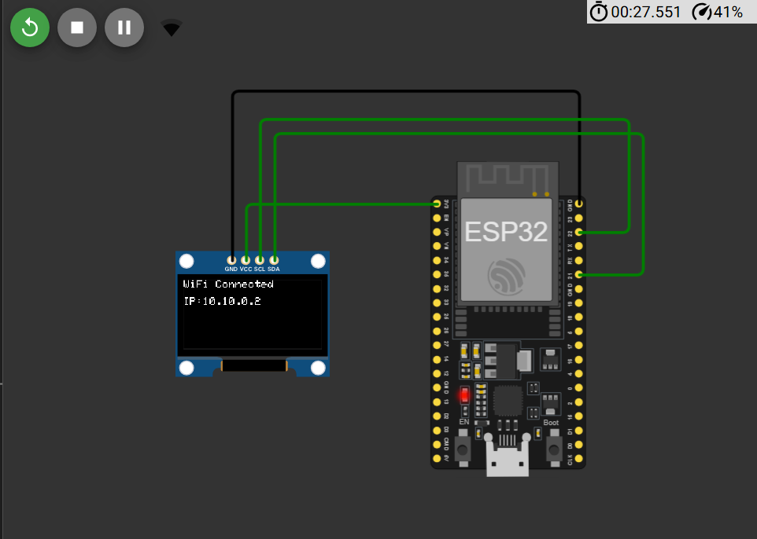

## ESP32 WiFi Status Display on OLED

## Overview

This project demonstrates how to connect an ESP32 to a WiFi network and display the connection status along with the assigned IP address on an SSD1306 OLED display.

The project is simulated using Wokwi and can also be deployed on a physical ESP32 board.

## Features

- Connects ESP32 to a WiFi network
- Displays connection progress on the OLED screen
- Shows WiFi connection status
- Displays the assigned IP address
- Prints connection details to the Serial Monitor
- Compatible with Wokwi simulation

## Components Required

| Component | Quantity |
|------------|----------|
| ESP32 DevKit V1 | 1 |
| SSD1306 OLED Display (128x64, I2C) | 1 |
| Jumper Wires | As Required |


## 🔗 Simulation Link

👉 [Open Simulation](https://wokwi.com/projects/465363998874227713)

---

## 🔌 Circuit Diagram

 

---

## Circuit Connections

| OLED Pin | ESP32 Pin |
|----------|-----------|
| VCC | 3.3V |
| GND | GND |
| SDA | GPIO 21 |
| SCL | GPIO 22 |

## Libraries Used

- WiFi.h
- Wire.h
- Adafruit GFX Library
- Adafruit SSD1306 Library

## How It Works

1. The ESP32 initializes the OLED display.
2. A "Connecting WiFi..." message is shown.
3. The ESP32 attempts to connect to the configured WiFi network.
4. Once connected:
   - The OLED displays "WiFi Connected".
   - The assigned IP address is shown.
   - The same information is printed to the Serial Monitor.

## Example Output

OLED Display:

```text
WiFi Connected

IP:
192.168.1.100
```

Serial Monitor:

```text
WiFi Connected
192.168.1.100
```

## Wokwi Simulation

This project can be simulated using Wokwi.

1. Create a new ESP32 project in Wokwi.
2. Add an SSD1306 OLED display.
3. Connect the OLED according to the circuit table above.
4. Upload the code.
5. Run the simulation.

## Applications

- IoT device status monitoring
- Network connectivity indication
- Smart home projects
- ESP32 learning and experimentation
- OLED display interfacing practice


## 👨‍💻 Author


**Kritish**

