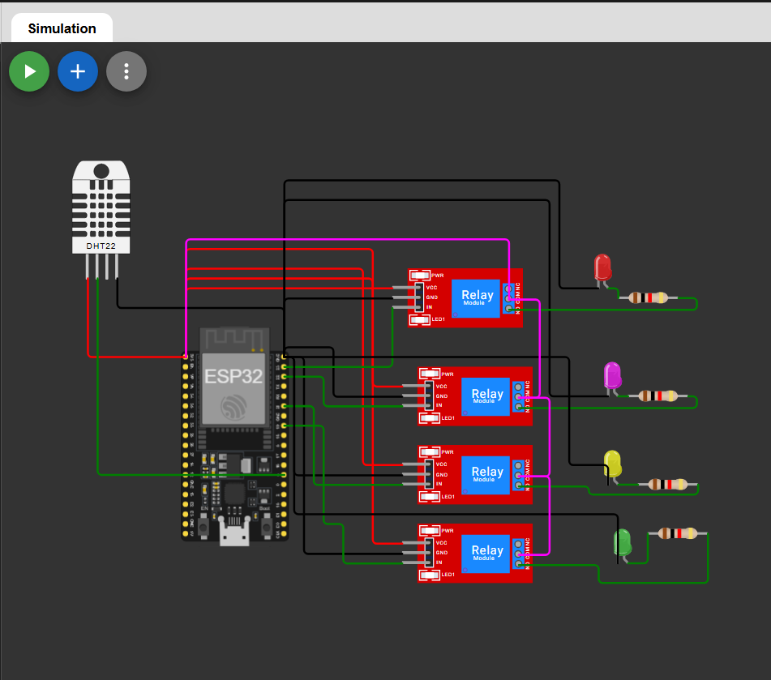

# ESP32 Home Automation with Blynk, 4 Relays, and DHT22

## Overview

This project demonstrates a Home Automation System using an ESP32, a 4-channel relay module, a DHT22 temperature sensor, and Blynk IoT. Users can remotely control four appliances through the Blynk mobile application while monitoring real-time temperature data.

## Features

* Remote control of 4 appliances using Blynk
* Real-time temperature monitoring
* ESP32 Wi-Fi connectivity
* Cloud-based control from anywhere
* Compatible with Wokwi Simulator

## Components Required

* ESP32 Development Board
* DHT22 Temperature Sensor
* 4-Channel Relay Module
* Blynk IoT Account
* Wi-Fi Connection

## 🔗 Simulation Link

👉 [Open Simulation](https://wokwi.com/projects/465710996295386113)

---

##  Circuit Diagram

 

### DHT22 Sensor

| DHT22 Pin | ESP32 Pin |
| --------- | --------- |
| VCC       | 3.3V      |
| GND       | GND       |
| DATA      | GPIO 4    |

### Relay Module

| Relay Channel | ESP32 GPIO |
| ------------- | ---------- |
| Relay 1       | GPIO 23    |
| Relay 2       | GPIO 22    |
| Relay 3       | GPIO 21    |
| Relay 4       | GPIO 19    |

## Blynk Virtual Pins

| Function            | Virtual Pin |
| ------------------- | ----------- |
| Relay 1 Control     | V1          |
| Relay 2 Control     | V2          |
| Relay 3 Control     | V3          |
| Relay 4 Control     | V4          |
| Temperature Display | V5          |

## Working Principle

1. ESP32 connects to the configured Wi-Fi network.
2. ESP32 establishes a connection with the Blynk Cloud.
3. The DHT22 sensor continuously measures ambient temperature.
4. Temperature readings are sent to the Blynk dashboard.
5. Users can control appliances through Blynk buttons.
6. Corresponding relays switch ON or OFF based on user commands.

## Blynk Dashboard Setup

Create the following widgets in your Blynk template:

| Widget                | Virtual Pin |
| --------------------- | ----------- |
| Button                | V1          |
| Button                | V2          |
| Button                | V3          |
| Button                | V4          |
| Gauge / Value Display | V5          |

### Button Configuration

* Mode: Switch
* Value: 0 (OFF), 1 (ON)

## Wokwi Simulation

### Components

* ESP32 DevKit V1
* DHT22 Sensor
* 4 Relay Modules

### Libraries

* Blynk
* DHT Sensor Library by Adafruit
* Adafruit Unified Sensor

## Applications

* Smart Home Automation
* Remote Appliance Control
* IoT Learning Projects
* Home Monitoring Systems
* Educational Demonstrations

## Future Enhancements

* Humidity Monitoring
* Voice Assistant Integration
* Appliance Scheduling
* Energy Consumption Monitoring
* Push Notifications and Alerts

## 👨‍💻 Author

**Kritish**

