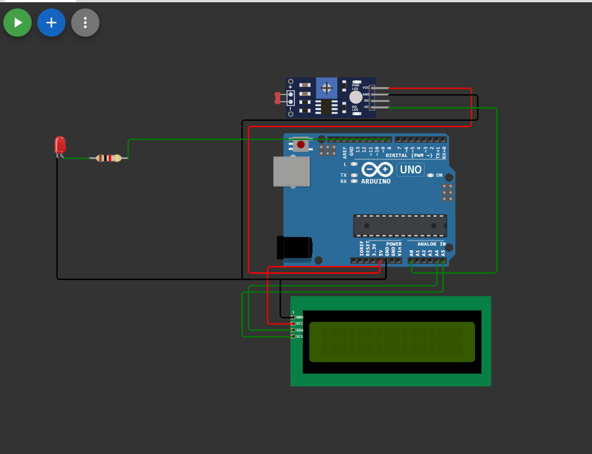

# LDR Street Light with Arduino and I2C LCD

This project demonstrates an automatic street light system using an LDR sensor module, Arduino Uno, and a 16x2 I2C LCD. The LED automatically turns ON in darkness and turns OFF in bright light.

## Components Used

- Arduino Uno
- LDR Sensor Module
- 16x2 I2C LCD
- LED
- 220Ω Resistor
- Jumper Wires
- Breadboard

---
#  Simulation Link
 [Open Simulation](https://wokwi.com/projects/464892410650194945)
##  Circuit Diagram

 

## Circuit Connections

### LDR Sensor Module

| LDR Module Pin | Arduino Uno |
|----------------|-------------|
| VCC            | 5V          |
| GND            | GND         |
| AO             | A0          |

---

### I2C LCD Connections

| LCD Pin | Arduino Uno |
|----------|-------------|
| VCC      | 5V          |
| GND      | GND         |
| SDA      | A4          |
| SCL      | A5          |

---

### LED Connections

| LED Pin | Arduino Uno |
|----------|-------------|
| Positive | Pin 8 (through 220Ω resistor) |
| Negative | GND |

---

## Arduino Code

```cpp
#include <Wire.h>
#include <LiquidCrystal_I2C.h>

LiquidCrystal_I2C lcd(0x27, 16, 2);

int ldrPin = A0;
int ledPin = 8;

void setup() {

  pinMode(ledPin, OUTPUT);

  lcd.init();
  lcd.backlight();

  lcd.setCursor(0, 0);
  lcd.print("Street Light");

  delay(2000);
  lcd.clear();
}

void loop() {

  int ldrValue = analogRead(ldrPin);

  lcd.setCursor(0, 0);
  lcd.print("LDR Value:");

  lcd.setCursor(0, 1);
  lcd.print(ldrValue);
  lcd.print("   ");

  // Dark Condition
  if (ldrValue < 500) {

    digitalWrite(ledPin, HIGH);

    lcd.setCursor(10, 1);
    lcd.print("ON ");
  }

  // Bright Condition
  else {

    digitalWrite(ledPin, LOW);

    lcd.setCursor(10, 1);
    lcd.print("OFF");
  }

  delay(500);
}
```

---

## How It Works

- The LDR module detects surrounding light intensity.
- In darkness:
  - LED turns ON
  - LCD displays `ON`
- In bright light:
  - LED turns OFF
  - LCD displays `OFF`

The LCD also displays the real-time LDR analog value.

---

## Wokwi Simulation

1. Open Wokwi
2. Create a new Arduino Uno project
3. Add:
   - Arduino Uno
   - LDR Sensor Module
   - I2C LCD 16x2
   - LED
4. Make the connections
5. Upload the code
6. Start the simulation

Wokwi Simulator: https://wokwi.com/

---

## Applications

- Automatic street lighting
- Smart lighting systems
- Energy-saving projects
- Home automation systems

---


## Author

Kritish Mohapatra