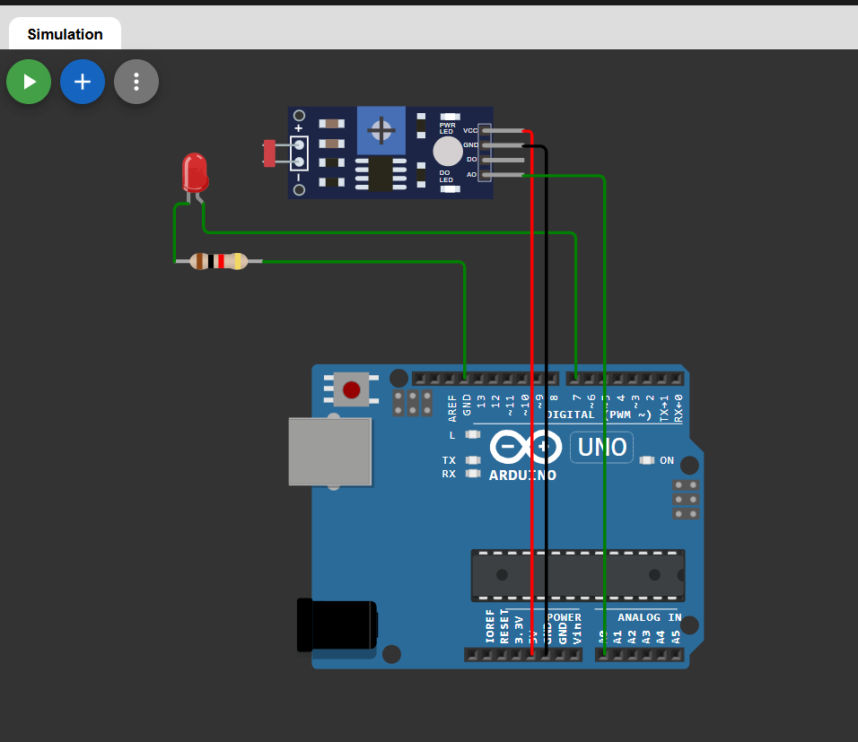

# 🌙 LDR Based Automatic Light using Arduino

This project demonstrates an **automatic light control system** using an LDR (Light Dependent Resistor) and an Arduino board.  
The LED automatically turns ON in darkness and turns OFF in bright light.

The project is simulated using Wokwi.

---

## 🔗 Simulation Link

👉 [Open Simulation](https://wokwi.com/projects/457287747031000065)

---

## 🔌 Circuit Diagram

👉 

---

## 🔧 Components Required

- Arduino Uno  
- LDR (Light Dependent Resistor)  
- 10kΩ Resistor  
- LED  
- 220Ω Resistor  
- Breadboard  
- Jumper Wires  

---

## 🔌 Pin Connections

| Component | Arduino Pin |
|-----------|-------------|
| LDR (Voltage Divider Output) | A0 |
| LED       | D7          |

### Connection Details:

**LDR Voltage Divider:**
- One leg of LDR → 5V  
- Other leg of LDR → A0  
- 10kΩ resistor → A0 to GND  

**LED:**
- LED positive leg → D7  
- LED negative leg → 220Ω resistor → GND  

---

## 🧠 Working Principle

- The LDR changes resistance based on light intensity.
- In bright light → Resistance decreases → Analog value changes.
- In darkness → Resistance increases → Analog value changes.
- Arduino reads the analog value from pin A0.
- If the value is below a threshold (dark condition), LED turns ON.
- If the value is above the threshold (bright condition), LED turns OFF.

---

## 💻 Arduino Code

```cpp
#define ldrPin A0
#define ledPin 7

int ldrValue = 0;
int threshold = 500;   // Adjust based on requirement

void setup() {
  pinMode(ledPin, OUTPUT);
  Serial.begin(9600);
}

void loop() {
  ldrValue = analogRead(ldrPin);
  Serial.println(ldrValue);

  if (ldrValue < threshold) {
    digitalWrite(ledPin, HIGH);  // Dark → LED ON
  } else {
    digitalWrite(ledPin, LOW);   // Bright → LED OFF
  }

  delay(200);
}
```
---
## 📌 Applications

- Automatic street lights

- Garden lighting systems

- Energy-saving home lighting

- Smart city projects

## 🚀 Future Improvements

- Adjustable threshold using potentiometer

- Use relay module for AC bulb control

- Add OLED/LCD to display light intensity

- Integrate with IoT for remote monitoring

- Add motion sensor for smart lighting


## 👨‍💻 Author


**Kritish**

