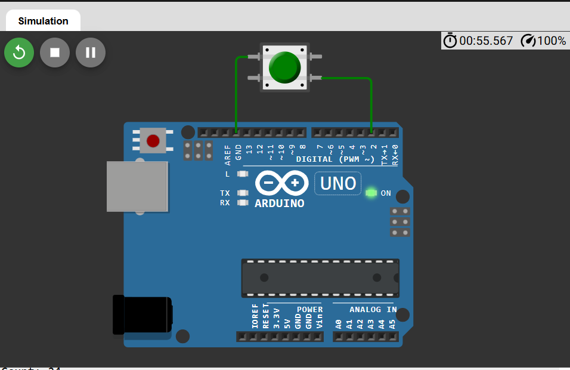

# 🔢 Push Button Counter using Arduino

This project demonstrates a **basic push button counter system** using an Arduino board.  
Every time the push button is pressed, the counter value increases by 1 and is displayed on the Serial Monitor.

---

## 🔗 Simulation Link

👉 [Open Simulation](https://wokwi.com/projects/457285664287279105)

---

## 🔌 Circuit Diagram

👉 

---

## 🔧 Components Required

- Arduino Uno  
- Push Button  
- 10kΩ Resistor (optional, if using external pull-down)  
- Breadboard  
- Jumper Wires  

---

## 🔌 Pin Connections (Using Internal Pull-up)

| Component     | Arduino Pin |
|--------------|-------------|
| Push Button  | D2          |

### Connection Details:
- One leg of button → **GND**
- Other leg → **D2**
- Internal pull-up resistor enabled in code

---

## 🧠 Working Principle

- The button is connected to **Digital Pin 2**
- Internal pull-up resistor keeps the pin **HIGH** by default
- When the button is pressed → pin becomes **LOW**
- The code detects a **HIGH to LOW transition**
- Counter value increases by 1
- Updated count is printed in Serial Monitor
- The process repeats continuously

---

## 💻 Arduino Code

```cpp
const int buttonPin = 2;
int buttonState = 0;
int lastButtonState = 0;
int counter = 0;

void setup() {
  pinMode(buttonPin, INPUT_PULLUP);
  Serial.begin(9600);
}

void loop() {
  buttonState = digitalRead(buttonPin);

  if (lastButtonState == HIGH && buttonState == LOW) {
    counter++;
    Serial.print("Count: ");
    Serial.println(counter);
    delay(200);   // basic debounce
  }

  lastButtonState = buttonState;
}
```
---

## 📌 Applications

 - Beginner Arduino practice

 - Understanding digital input handling

- Learning edge detection

- Basic embedded systems projects

## 🚀 Future Improvements

- Proper software debouncing using millis()

- Add LCD/OLED display

- Add reset button

- Use interrupt-based button detection

- Store counter value in EEPROM


## 👨‍💻 Author


**Kritish**

