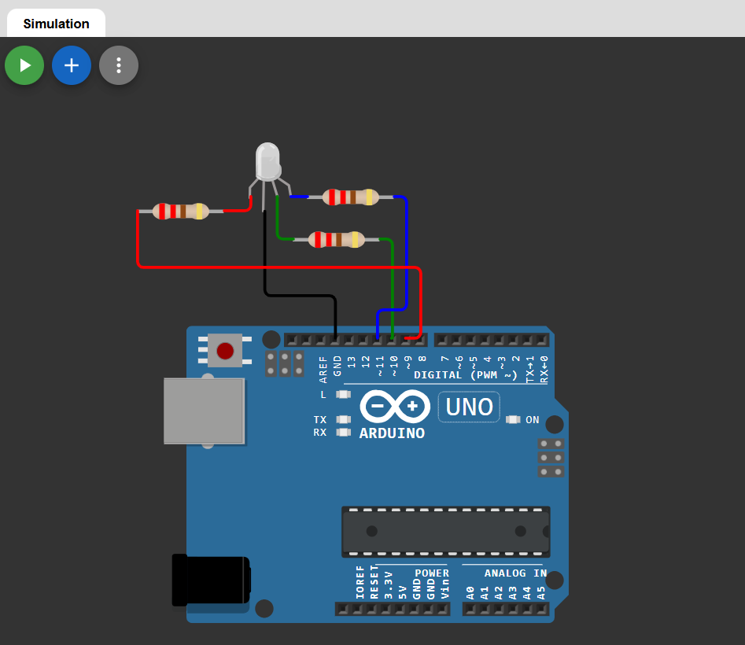

# 🌈 RGB LED Control using Arduino (With Serial Monitor Output)

This project demonstrates how to control an **RGB LED** using an Arduino.  
Different colors are generated using PWM, and the active color name is displayed on the Serial Monitor.

The project can be simulated using Wokwi.

---

## 🔗 Simulation Link

👉 [Open Simulation](https://wokwi.com/projects/457367295564116993)

---

## 🔌 Circuit Diagram

👉 

---

## 🔧 Components Required

- Arduino Uno  
- RGB LED (Common Cathode)  
- 3 × 220Ω Resistors  
- Breadboard  
- Jumper Wires  

---

## 🔌 Pin Connections (Common Cathode RGB LED)

| RGB Pin | Arduino Pin |
|---------|------------|
| Red     | D9         |
| Green   | D10        |
| Blue    | D11        |
| Cathode | GND        |

### Connection Details

- Connect each color pin through a 220Ω resistor to Arduino.
- Connect the common cathode pin to GND.
- PWM pins (9, 10, 11) are used for brightness control.

---

## 🧠 Working Principle

- RGB LED contains three internal LEDs: Red, Green, and Blue.
- Arduino uses `analogWrite()` to control brightness (0–255).
- Different intensity combinations create different colors.
- Each time the color changes, its name is printed on the Serial Monitor.

---

## 💻 Arduino Code

```cpp
#define redPin 9
#define greenPin 10
#define bluePin 11

void setup() {
  pinMode(redPin, OUTPUT);
  pinMode(greenPin, OUTPUT);
  pinMode(bluePin, OUTPUT);
  Serial.begin(9600);
}

void loop() {

  Serial.println("Color: RED");
  analogWrite(redPin, 255);
  analogWrite(greenPin, 0);
  analogWrite(bluePin, 0);
  delay(1000);

  Serial.println("Color: GREEN");
  analogWrite(redPin, 0);
  analogWrite(greenPin, 255);
  analogWrite(bluePin, 0);
  delay(1000);

  Serial.println("Color: BLUE");
  analogWrite(redPin, 0);
  analogWrite(greenPin, 0);
  analogWrite(bluePin, 255);
  delay(1000);

  Serial.println("Color: YELLOW");
  analogWrite(redPin, 255);
  analogWrite(greenPin, 255);
  analogWrite(bluePin, 0);
  delay(1000);

  Serial.println("Color: CYAN");
  analogWrite(redPin, 0);
  analogWrite(greenPin, 255);
  analogWrite(bluePin, 255);
  delay(1000);

  Serial.println("Color: MAGENTA");
  analogWrite(redPin, 255);
  analogWrite(greenPin, 0);
  analogWrite(bluePin, 255);
  delay(1000);

  Serial.println("Color: WHITE");
  analogWrite(redPin, 255);
  analogWrite(greenPin, 255);
  analogWrite(bluePin, 255);
  delay(1000);
}
```
---
## 📌 Applications

- Decorative lighting

- Mood lighting systems

- Smart home lighting

- Color mixing experiments

- Embedded systems learning

## 🚀 Future Improvements

- Smooth color fading using PWM

- Control RGB via Serial input

- Bluetooth-based RGB control

- IoT web dashboard integration

- Potentiometer-based color mixing

## 👨‍💻 Author


**Kritish**

