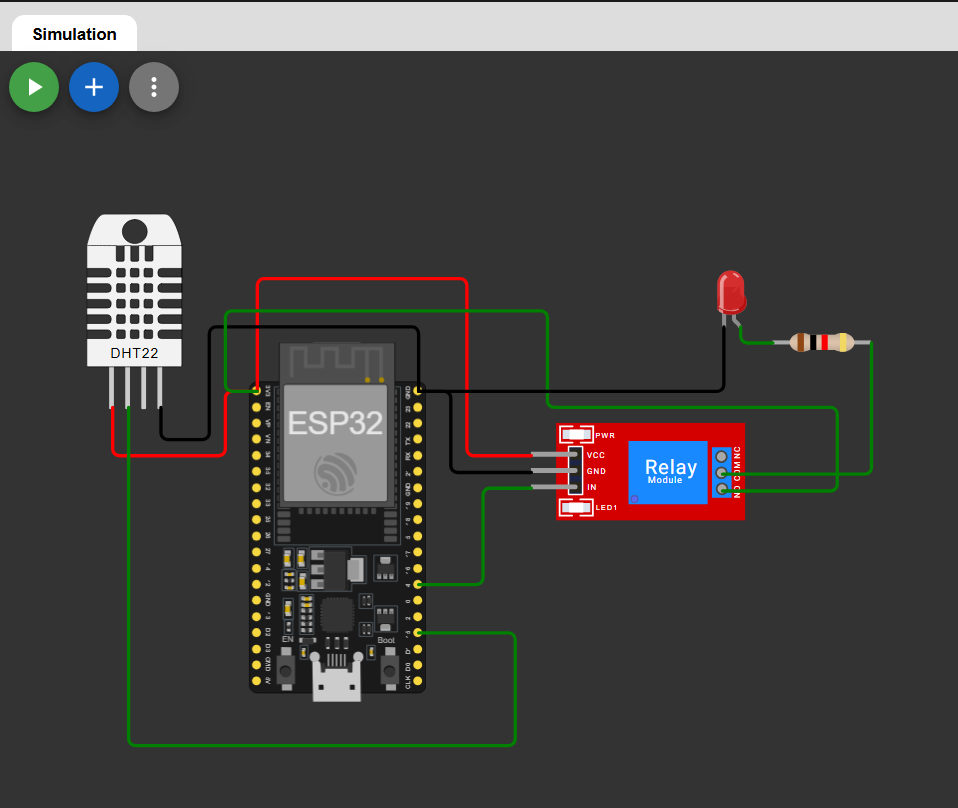

# Temperature Based Relay Control Using ESP32

## Overview

This project demonstrates a temperature-based relay control system using an ESP32 and a DHT22 temperature sensor. The ESP32 continuously monitors the ambient temperature and controls a relay based on a predefined temperature threshold.

When the temperature exceeds the threshold value, the relay turns ON. When the temperature falls below the threshold, the relay turns OFF.

This project can be simulated easily in Wokwi and serves as a basic example of automation and environmental monitoring.

---

## Features

- Real-time temperature monitoring using DHT22
- Automatic relay control based on temperature
- Serial Monitor output for temperature readings
- Adjustable temperature threshold
- Suitable for cooling and automation applications
- Wokwi simulation compatible

---

## Components Required

- ESP32 DevKit V1
- DHT22 Temperature Sensor
- Relay Module
- Jumper Wires

---

## 🔗 Simulation Link

👉 [Open Simulation](https://wokwi.com/projects/465515280918742017)

---

## 🔌 Circuit Diagram

👉 

## Circuit Connections

| Component | ESP32 Pin |
|------------|-----------|
| DHT22 Data | GPIO 15 |
| Relay IN | GPIO 4 |
| DHT22 VCC | 3.3V |
| DHT22 GND | GND |
| Relay VCC | 3.3V |
| Relay GND | GND |

---

## Working Principle

1. The DHT22 sensor measures the ambient temperature.
2. ESP32 reads the temperature data from the sensor.
3. The measured temperature is compared with a predefined threshold value.
4. If the temperature exceeds the threshold:
   - Relay turns ON.
5. If the temperature is below the threshold:
   - Relay turns OFF.
6. Temperature and relay status are displayed in the Serial Monitor.

---

## Temperature Threshold

```cpp
float thresholdTemp = 30.0;
```

You can modify this value according to your application requirements.

---

## Sample Serial Output

```text
Temperature: 28.50 °C
Relay OFF

Temperature: 31.20 °C
Relay ON

Temperature: 29.80 °C
Relay OFF
```

---

## Applications

- Automatic fan control
- Smart cooling systems
- Temperature-based automation
- Industrial monitoring
- Greenhouse temperature management
- IoT environmental control systems

---

## Simulation

This project can be simulated using Wokwi by adjusting the DHT22 temperature value during runtime to observe relay switching behavior.

---

## Future Improvements

- Add OLED or LCD display
- Implement Blynk or MQTT integration
- Add humidity-based control
- Enable remote monitoring through Wi-Fi
- Store temperature logs in a database

---


## 👨‍💻 Author


**Kritish**

