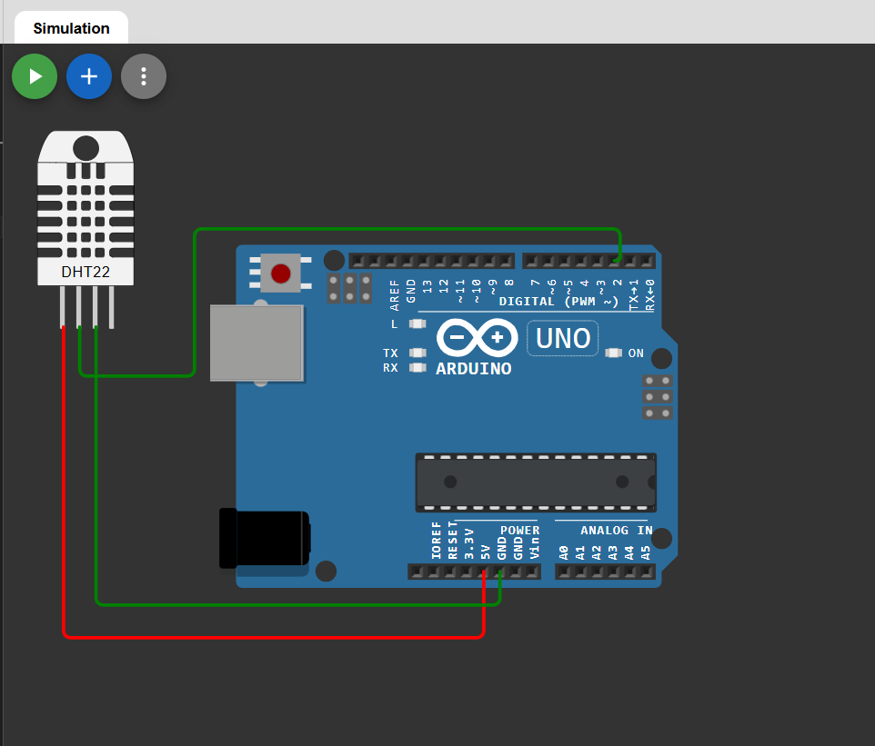

# 🌡 Temperature Display using Arduino (DHT22)

This project demonstrates a **temperature monitoring system** using an Arduino and DHT22 sensor.  
The temperature value is read from the sensor and displayed on the Serial Monitor.

The project is simulated using Wokwi.

---

## 🔗 Simulation Link

👉 [Open Simulation](https://wokwi.com/projects/457308124102977537)

---

## 🔌 Circuit Diagram

👉 

---

## 🔧 Components Required

- Arduino Uno  
- DHT22
- Breadboard  
- Jumper Wires  

---

## 🔌 Pin Connections

| Component | Arduino Pin |
|-----------|-------------|
| DHT22 VCC | 5V          |
| DHT22 GND | GND         |
| DHT22 DATA| D2          |

---

## 🧠 Working Principle

- The DHT22 measures temperature and humidity.
- Arduino reads digital data from pin D2.
- Temperature value is extracted.
- The value is printed on the Serial Monitor.
- The process repeats every 2 seconds.

---

## 💻 Arduino Code

```cpp
#include <DHT.h>

#define DHTPIN 2
#define DHTTYPE DHT22

DHT dht(DHTPIN, DHTTYPE);

void setup() {
  Serial.begin(9600);
  dht.begin();
}

void loop() {
  float temperature = dht.readTemperature();

  if (isnan(temperature)) {
    Serial.println("Failed to read from DHT sensor!");
    return;
  }

  Serial.print("Temperature: ");
  Serial.print(temperature);
  Serial.println(" °C");

  delay(2000);
}
```
---
## 📌 Applications

- Room temperature monitoring

- Smart home systems

- Weather stations

- IoT temperature logging

## 🚀 Future Improvements

- Display on LCD/OLED

- Add humidity display

- Add temperature alert buzzer

- IoT cloud integration


## 👨‍💻 Author


**Kritish**

