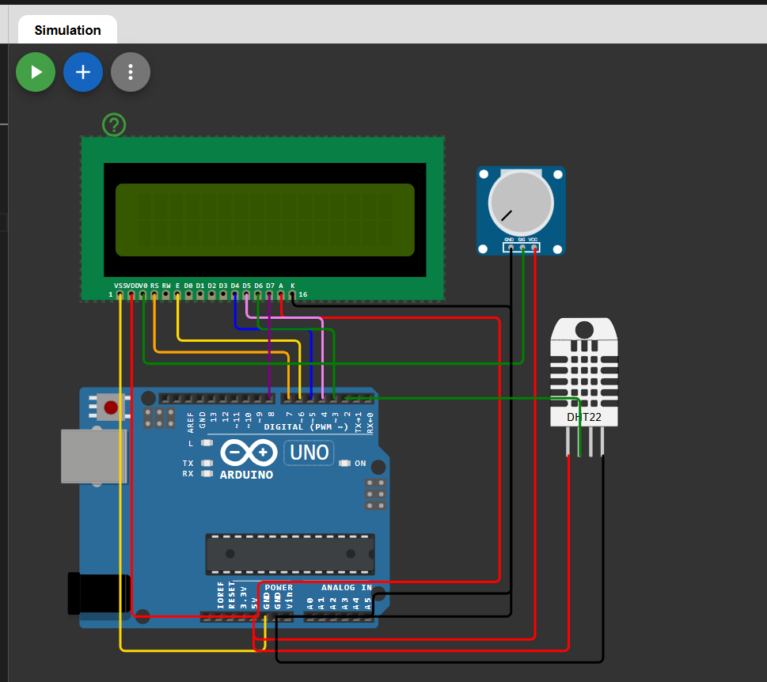

# 🌡 Temperature and Humidity Display on LCD using Arduino

This project demonstrates a **temperature and humidity monitoring system** using an Arduino, DHT sensor, and 16x2 LCD display.  
The real-time temperature and humidity values are displayed on the LCD screen.

The project can be simulated using Wokwi.

---

## 🔗 Simulation Link

👉 [Open Simulation](https://wokwi.com/projects/457369342923877377)

---

## 🔌 Circuit Diagram

👉 

---

## 🔧 Components Required

- Arduino Uno  
- DHT22
- 16x2 LCD Display  
- 10kΩ Potentiometer (for LCD contrast)  
- Breadboard  
- Jumper Wires  

---

## 🔌 Pin Connections

### 📍 DHT22 Connections

| DHT22 Pin | Arduino Pin |
|------------|------------|
| VCC        | 5V         |
| GND        | GND        |
| DATA       | D2         |

---

### 📍 LCD (16x2) Connections (4-bit Mode)

| LCD Pin | Arduino Pin |
|----------|------------|
| RS       | D7         |
| E        | D6         |
| D4       | D5         |
| D5       | D4         |
| D6       | D3         |
| D7       | D8         |
| VSS      | GND        |
| VDD      | 5V         |
| VO       | Potentiometer Middle Pin |
| A (LED+) | 5V         |
| K (LED-) | GND        |

---

## 🧠 Working Principle

- The DHT22 measures temperature and humidity.
- Arduino reads digital data from pin D2.
- The values are processed.
- Temperature is displayed on the first row of LCD.
- Humidity is displayed on the second row.
- The display updates every 2 seconds.

---

## 💻 Arduino Code

```cpp
#include <LiquidCrystal.h>
#include <DHT.h>

#define DHTPIN 2
#define DHTTYPE DHT22

LiquidCrystal lcd(7, 6, 5, 4, 3, 8);
DHT dht(DHTPIN, DHTTYPE);

void setup() {
  lcd.begin(16, 2);
  dht.begin();
}

void loop() {
  float temperature = dht.readTemperature();
  float humidity = dht.readHumidity();

  lcd.clear();

  if (isnan(temperature) || isnan(humidity)) {
    lcd.setCursor(0, 0);
    lcd.print("Sensor Error");
    return;
  }

  lcd.setCursor(0, 0);
  lcd.print("Temp: ");
  lcd.print(temperature);
  lcd.print(" C");

  lcd.setCursor(0, 1);
  lcd.print("Hum: ");
  lcd.print(humidity);
  lcd.print(" %");

  delay(2000);
}
```
---
## 📌 Applications

- Room environment monitoring

- Smart home automation

- Weather station projects

- Industrial monitoring systems

- IoT-based environmental tracking

## 🚀 Future Improvements

- Add buzzer for high temperature alert

- Display heat index

- Use I2C LCD module

- Send data to cloud via WiFi

- Add data logging to SD card

## 👨‍💻 Author


**Kritish**

