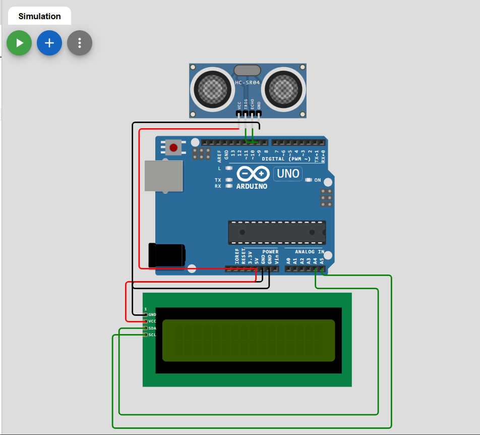

## Ultrasonic Distance Measurement using Arduino and I2C LCD

This project measures distance using the HC-SR04 Ultrasonic Sensor and displays the measured distance on a 16x2 I2C LCD using Arduino Uno.

## Components Required

- Arduino Uno
- HC-SR04 Ultrasonic Sensor
- 16x2 I2C LCD
- Breadboard
- Jumper Wires

---

##  Simulation Link
 [Open Simulation](https://wokwi.com/projects/464893670355008513)
##  Circuit Diagram

 

## Circuit Connections

### HC-SR04 to Arduino

| HC-SR04 Pin | Arduino Pin |
|-------------|-------------|
| VCC         | 5V          |
| GND         | GND         |
| TRIG        | 9           |
| ECHO        | 10          |

### I2C LCD to Arduino

| I2C LCD Pin | Arduino Pin |
|--------------|-------------|
| VCC          | 5V          |
| GND          | GND         |
| SDA          | A4          |
| SCL          | A5          |

---

## Required Library

Install the following library from Arduino IDE Library Manager:

- `LiquidCrystal_I2C`

---

## Arduino Code

```cpp
#include <Wire.h>
#include <LiquidCrystal_I2C.h>

LiquidCrystal_I2C lcd(0x27, 16, 2);

const int trigpin = 9;
const int echopin = 10;

long duration;
float distance;

void setup() {

  pinMode(trigpin, OUTPUT);
  pinMode(echopin, INPUT);

  lcd.init();
  lcd.backlight();

  lcd.setCursor(0, 0);
  lcd.print("Ultrasonic");

  lcd.setCursor(0, 1);
  lcd.print("Distance meter");

  delay(2000);
  lcd.clear();
}

void loop() {

  digitalWrite(trigpin, LOW);
  delayMicroseconds(2);

  digitalWrite(trigpin, HIGH);
  delayMicroseconds(10);
  digitalWrite(trigpin, LOW);

  duration = pulseIn(echopin, HIGH);

  distance = duration * 0.034 / 2;

  lcd.clear();

  lcd.setCursor(0, 0);
  lcd.print("Distance:");

  lcd.setCursor(0, 1);
  lcd.print(distance);
  lcd.print(" cm");

  delay(500);
}
```

---

## Working Principle

The HC-SR04 ultrasonic sensor sends ultrasonic sound waves and waits for the reflected signal. The Arduino calculates the travel time of the wave and determines the distance.

Distance Formula:

```text
Distance = (Duration × 0.034) / 2
```

Where:

- `0.034` = Speed of sound in cm/µs
- Division by `2` because the wave travels to the object and back

---

## Output

The measured distance is displayed continuously on the 16x2 I2C LCD in centimeters.

---

## Applications

- Obstacle Detection
- Distance Measurement
- Robotics Projects
- Smart Parking Systems
- Automation Projects

---

## Notes

- If the LCD does not display anything, try changing the I2C address from `0x27` to `0x3F`.
- Use an I2C scanner sketch to find the correct LCD address if needed.
- Removing `lcd.clear()` from the loop can reduce display flickering.

---

## Author

Kritish Mohapatra